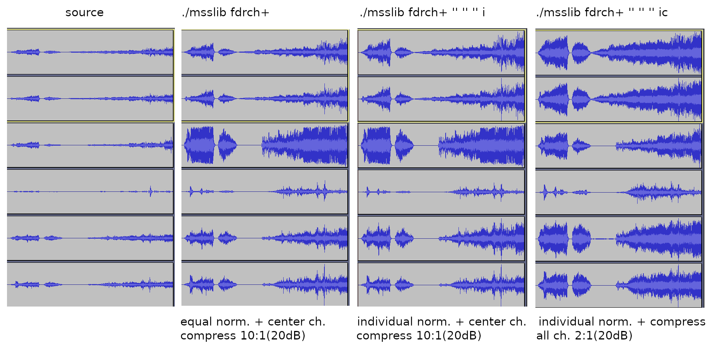

#### Media Works Shell Scripts
## [**msslib**](msslib)
It uses **ffmpeg, bash** and some simple commands to normalize audio volume, compress audio volume, recompress, accelerate/deaccelerate the speed, split video/audio files and so on. There are scripts:
- to process video
  - **csvc** - acceleration and deacceleration the speed for video files or cuts in video files during reencoding
  - **pvp** - divides the video stream to parts and processing them simultaneously; it may be helpful in case using slow single thread video filter on multicores cpu
  - **nvenc2mp4** - nvidia hardware accelerated video transcoding script
  - **mpeh** - allow to find a "high motion" zones and increase bitrate of them during analysing x264-2-pass.log file
- to process audio streams in video files
  - **fdrch+** - force dynamic range compression to center channel, makes the sound of center channel (FC) louder, it also contain "fdrc" functionality for stereo/mono channels
- to process audio only
  - **nit** - "normalize it" - normalize the volume of audio files
  - **cuesplit** - split one audio into separate flac files corresponding to the CUE
  - **tempo** - acceleration and deacceleration the speed of audio files
  - **lca** - add a local cover picture to mp3 or flac or mka -files
>**for help run ./msslib -h**

There are [**old versions of scripts**](archive) 

> Known issue: ffmpeg may create auto tags for mkv files; in case you have any trouble of playing processed mkv files just remux it by mkvtoolnix with unselected tags.

There are some [**examples**](some_examples) of how it can be used 

Processing with singlethreaded video filter

